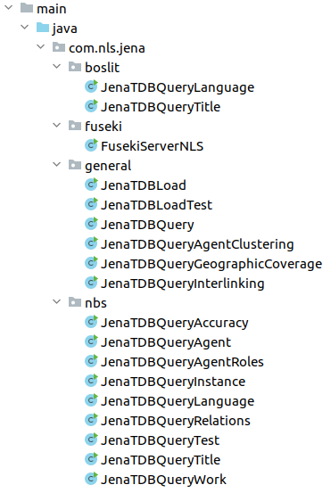

# nls-jena-tdb
Java project for the analysis of the RDF data generated from the National Bibliography of Scotland.

## Note
Created in October-December 2022 for the National Library of Scotland's Data Foundry by [Gustavo Candela, National Librarian’s Research Fellowship in Digital Scholarship 2022-23](https://data.nls.uk/projects/the-national-librarians-research-fellowship-in-digital-scholarship-2022-23/)

In particular, this project uses the [RDF](https://www.w3.org/RDF/) dataset generated based on the National Bibliography of Scotland dataset published by the National Library of Scotland. See more details in [this link] (https://github.com/hibernator11/nls-fellowship-2022-23#national-bibliography-of-scotland).


## Running the project
Beffore running the project, we need to download the libraries and compile the code. We need to run the command:

```
mvn clean install
```

## Structure of the project
This project is based on Java and Maven. It requires Maven installed in your computer to be able to run the project.

The following image describes the structure of the project.

- db: folder used by JenaTDB to load and store the RDF dataset
- dbtest: folder used by JenaTDB to load and store the RDF samples provided in the rdf folder
- logs: log of the code
- rdf: examples of RDF files created from the National Bibliography of Scotland using the tool [marc2bibframe2](https://github.com/lcnetdev/marc2bibframe2)
- src/main/java: main Java classes included in the project (described below)
- src/main/resources: additional files such as [log4j2.xml](https://logging.apache.org/log4j/2.x/manual/configuration.html) to configure the log (trace,warn,error,info).
- pom.xml: contains information to build the project such as dependencies, build directory, source directory,...In order to be able to work with Jena TDB, this file includes the dependency [apache-jena-libs](https://mvnrepository.com/artifact/org.apache.jena/apache-jena-libs)




Several classes are provided to analyse the content of the dataset. These are the classes found in the project:

- JenaTDBLoad: loading into the folder `db` the RDF files provided in the folder `rdf`. This path can be changed in order to provide the folder with the RDF files.  
- JenaTDBLoadTest: loading the RDF files into the folder `dbtest` provided in the folder rdf for testing purposes.
- JenaTDBQuery: this class executes general SPARQL queries to retrieve the number of classes and properties
- JenaTDBQueryAgent: this class analyses the resources typed as bf:Agent
- JenaTDBQueryClustering: this class analyses if the resources typed as bf:Agent are clustered by name
- JenaTDBQueryGeographicCoverage: this class analyses the resources typed as bf:GeographicCoverage
- JenaTDBQueryInstance: this class analyses the resources typed as bf:Instance
- JenaTDBQueryLanguage: this class analyses the languages included in the dataset
- JenaTDBQueryTitle: this class analyses how the resources bf:Title are modelled
- JenaTDBQueryWork: this class analyses the resources typed as bf:Work

## Example of code
All the classes provided in the project are based on the same structure. First, we open the Jena TDB dataset, then we create a transaction for reading, we define the SPARQL query and retrieve the results. Finally, we close the transaction and the dataset to release the resources.

```
// open dataset
Path path = Paths.get(".").toAbsolutePath().normalize();
String dbDir = path.toFile().getAbsolutePath() + "/db/";
Location location = Location.create(dbDir);
Dataset dataset = TDB2Factory.connectDataset(location);
```

```
// create transaction for reading
dataset.begin(ReadWrite.READ);
QueryExecution qe = QueryExecutionFactory.create("SELECT distinct ?type " +
                                                "WHERE {?s a ?type }", dataset);
for (ResultSet results = qe.execSelect(); results.hasNext();) {
    QuerySolution qs = results.next();
    String strValue = qs.get("?type").toString();
    logger.info("value = " + strValue);
}
```

```
// Releasing dataset resources
dataset.close();
```


