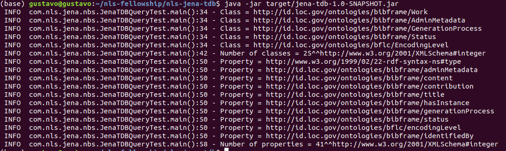

# nls-jena-tdb

Created in October-December 2022 for the National Library of Scotland's Data Foundry by [Gustavo Candela, National Librarian’s Research Fellowship in Digital Scholarship 2022-23](https://data.nls.uk/projects/the-national-librarians-research-fellowship-in-digital-scholarship-2022-23/)

In particular, this project uses the [RDF](https://www.w3.org/RDF/) dataset generated based on the National Bibliography of Scotland dataset published by the National Library of Scotland. See more details in [this link] (https://github.com/hibernator11/nls-fellowship-2022-23#national-bibliography-of-scotland).

### Table of Contents
- [Datasets](#datasets)
- [Setup](#setup)
- [Loading RDF](#loading-rdf)
- [Suggested Citations](#suggested-citations)
- [Structure of the project](#structure-of-the-project)
- [Example of code](#example-of-code)
- [References](#references)

## Datasets

### Collection 1: The National Bibliography of Scotland (version 2)
- Owner: National Library of Scotland
- Creator: National Library of Scotland
- Website: Visit the [NLS Data Foundry](https://data.nls.uk/data/metadata-collections/national-bibliography-of-scotland/)
- DOI: https://doi.org/10.34812/7cda-ep21
- Date created: 2022
- Licence: Creative Commons Attribution 4.0 International ([CC-BY 4.0](https://creativecommons.org/licenses/by/4.0/))

### Collection 2: Bibliography of Scottish Literature in Translation 
- Owner: National Library of Scotland
- Creator: National Library of Scotland
- Website: Visit the [NLS Data Foundry](https://data.nls.uk/data/metadata-collections/boslit/)
- Licence: Creative Commons Attribution 4.0 International ([CC-BY 4.0](https://creativecommons.org/licenses/by/4.0/))


## Setup

This project is based on [Apache Maven](https://maven.apache.org), a build-automation tool designed to provide a comprehensive and easy-to-use way of developing Java applications. the use of this code requires the installation of [Apache Maven]([Apache Maven](https://maven.apache.org/install.html)).

Before running the project, we need to download the libraries and compile the code. We need to run the command:

```
mvn package
```

Running this command will create a list of files in a new `target` directory.

We can use the java command to execute our JAR file:
```
java -jar target/jena-tdb-1.0-SNAPSHOT.jar
```

In order to run other classes we can use the following command:
```
mvn exec:java -Dexec.mainClass="com.nls.jena.nbs.JenaTDBQueryAgent"
```



**Note that this code does not provide the entire RDF dataset due to size constraints. This code is provided as an example of how Jena TDB can be used to load and query an RDF dataset. This example uses the files provided in the `rdf` folder for testing purposes.**

This Java project can be edited in Integrated Development Environments such as [Idea](https://www.jetbrains.com/idea/) and [Eclipse](https://www.eclipse.org/). 

## Loading RDF
The class `JenaTDBLoad` is in charge of loading the RDF into the RDF Jena TDB storage system. The RDF files must be places in the folder `rdf`. The following code shows the process:

```
 // Create dataset
Path path = Paths.get(".").toAbsolutePath().normalize();
String dbDir = path.toFile().getAbsolutePath() + "/db/";
Location location = Location.create(dbDir);
Dataset dataset = TDB2Factory.connectDataset(location);

dataset.begin(ReadWrite.WRITE);
Model model = dataset.getDefaultModel();

//Files.walk(Paths.get("/home/gustavo/nls-fellowship/nls-fellowship-2022-23/rdf"))
Files.walk(Paths.get(path.toFile().getAbsolutePath() +"/rdf"))
        .filter(p -> p.toString().endsWith(".gz"))
        .forEach(p -> {
            logger.info(p.toFile().getAbsolutePath());
            try {
                RDFDataMgr.read(model, p.toFile().getAbsolutePath(), Lang.RDFXML);
            }catch (Exception e){
                logger.error(p.toFile().getAbsolutePath() + e.getMessage());
            }
        });
dataset.commit();

// Releasing dataset resources
dataset.close();
```

For the instructions to generate the RDF from scratch please follow the following [link](https://github.com/hibernator11/nls-fellowship-2022-23/blob/master/README.md#generating-the-rdf).

## Structure of the project
This project is based on Java and Maven. It requires Maven installed in your computer to be able to run the project.

The following image describes the structure of the project.

- db: folder used by JenaTDB to load and store the RDF dataset
- dbtest: folder used by JenaTDB to load and store the RDF samples provided in the rdf folder
- logs: log of the code
- rdf: examples of RDF files created from the National Bibliography of Scotland using the tool [marc2bibframe2](https://github.com/lcnetdev/marc2bibframe2)
- src/main/java: main Java classes included in the project (described below)
- src/main/resources: additional files such as [log4j2.xml](https://logging.apache.org/log4j/2.x/manual/configuration.html) to configure the log (trace,warn,error,info).
- pom.xml: contains information to build the project such as dependencies, build directory, source directory,...In order to be able to work with Jena TDB, this file includes the dependency [apache-jena-libs](https://mvnrepository.com/artifact/org.apache.jena/apache-jena-libs)


Several classes are provided to analyse the content of the dataset. These are the classes found in the project:

- JenaTDBLoad: loading into the folder `db` the RDF files provided in the folder `rdf`. This path can be changed in order to provide the folder with the RDF files.  
- JenaTDBLoadTest: loading the RDF files into the folder `dbtest` provided in the folder rdf for testing purposes.
- JenaTDBQueryTest: this class executes general SPARQL queries to retrieve the number of classes and properties included the folder `dbtest`
- JenaTDBQuery: this class executes general SPARQL queries to retrieve the number of classes and properties
- JenaTDBQueryAgent: this class analyses the resources typed as bf:Agent
- JenaTDBQueryAgentRoles: this class analyses the roles used for the resources typed as bf:Agent when establishing a relationship with bf:Work resources
- JenaTDBQueryClustering: this class analyses if the resources typed as bf:Agent are clustered by name
- JenaTDBQueryGeographicCoverage: this class analyses the resources typed as bf:GeographicCoverage
- JenaTDBQueryInstance: this class analyses the resources typed as bf:Instance
- JenaTDBQueryLanguage: this class analyses the languages included in the dataset
- JenaTDBQueryTitle: this class analyses how the resources bf:Title are modelled
- JenaTDBQueryWork: this class analyses the resources typed as bf:Work
- JenaTDBQueryRelations: this class inspects how the resources typed as bf:Work are related with other resources such as bf:Work and bf:Hub

## Example of code
All the classes provided in the project are based on the same structure. First, we open the Jena TDB dataset, then we create a transaction for reading, we define the SPARQL query and retrieve the results. Finally, we close the transaction and the dataset to release the resources.

```
// open dataset
Path path = Paths.get(".").toAbsolutePath().normalize();
String dbDir = path.toFile().getAbsolutePath() + "/db/";
Location location = Location.create(dbDir);
Dataset dataset = TDB2Factory.connectDataset(location);
```

```
// create transaction for reading
dataset.begin(ReadWrite.READ);
QueryExecution qe = QueryExecutionFactory.create("SELECT distinct ?type " +
                                                "WHERE {?s a ?type }", dataset);
for (ResultSet results = qe.execSelect(); results.hasNext();) {
    QuerySolution qs = results.next();
    String strValue = qs.get("?type").toString();
    logger.info("value = " + strValue);
}
```

```
// Releasing dataset resources
dataset.close();
```

## References
- https://github.com/lcnetdev/marc2bibframe2
- https://jena.apache.org/documentation/tdb2/

